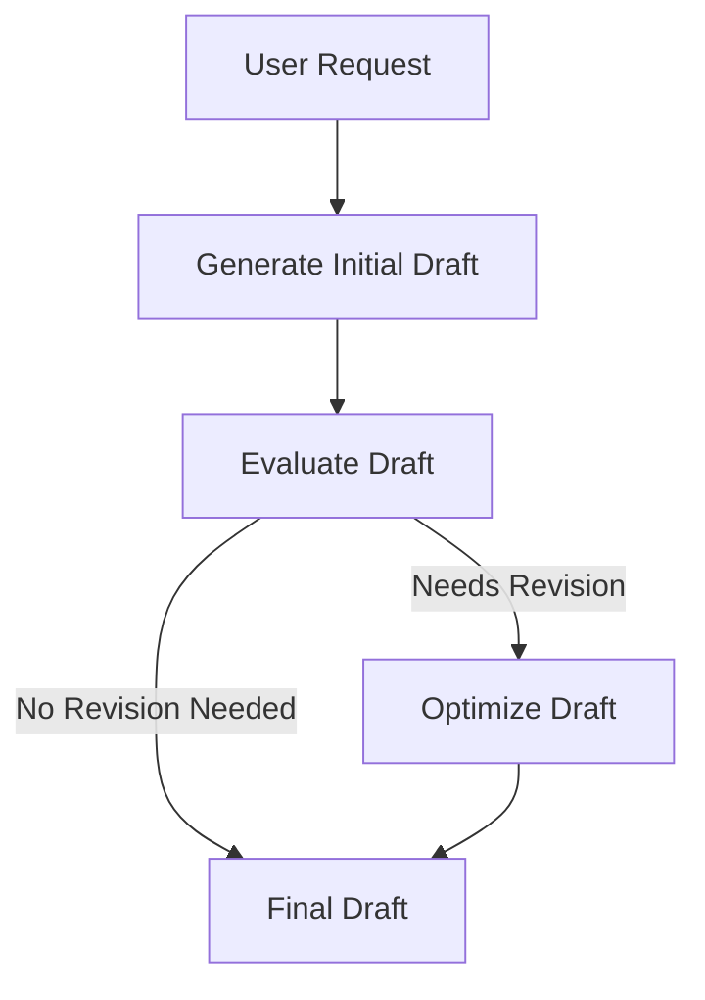

# Evaluator Optimiser

Evaluator Optimiser is a sophisticated workflow application designed to iteratively refine and optimize textual drafts using AI models. It leverages a combination of large and small language models to generate, evaluate, and enhance text based on feedback.

## Table of Contents
1. [Overview](#overview)
2. [Usage](#usage)
3. [Architecture](#architecture)

## Overview
The Evaluator Optimiser project is built to automate the process of drafting, evaluating, and optimizing text. It uses a workflow pattern that involves generating an initial draft, evaluating it for improvements, and then optimizing the draft based on feedback. This process is facilitated by AI models, specifically the Llama models, to ensure high-quality output.

## Usage
To start the project locally, you can use the following npm scripts:

- **deploy**: Deploys the application using Wrangler.
  ```bash
  npx nx deploy evaluator-optimiser
  ```
- **dev**: Starts the development server with Wrangler.
  ```bash
  npx nx dev evaluator-optimiser
  ```
- **lint**: Lints the source code using Biome.
  ```bash
  npx nx lint evaluator-optimiser
  ```
- **start**: Alias for `dev`, starts the development server.
  ```bash
  npx nx start evaluator-optimiser
  ```
- **test**: Runs the test suite using Vitest.
  ```bash
  npx nx test evaluator-optimiser
  ```
- **test:ci**: Runs the test suite in CI mode.
  ```bash
  npx nx test:ci evaluator-optimiser
  ```
- **type-check**: Performs TypeScript type checking.
  ```bash
  npx nx type-check evaluator-optimiser
  ```

### API Endpoints
The project exposes a RESTful API with the following endpoints:

- **POST /**: Triggers a new workflow instance.
  - **Request**: JSON payload with a `prompt` property.
  - **Response**: JSON object containing the instance ID and status details.
  - **Curl Command**:
    ```bash
    curl -X POST http://localhost:8787/ -H "Content-Type: application/json" -d '{"prompt": "Your prompt here"}'
    ```

- **GET /:id**: Fetches the status of an existing workflow instance by its ID.
  - **Response**: JSON object containing the status of the workflow instance.
  - **Curl Command**:
    ```bash
    curl http://localhost:8787/{id}
    ```

## Architecture
The Evaluator Optimiser application follows a structured workflow pattern known as the Evaluator-Optimizer pattern. This involves an iterative loop where a draft is generated, evaluated, and optimized based on feedback.

### System Diagram


### Evaluator-Optimizer Pattern
The Evaluator-Optimizer pattern is a workflow pattern where tasks are iteratively refined through a loop of execution and evaluation. In this project, the pattern is implemented as follows:

- **Step 1**: Generate an initial draft using a small language model.
- **Step 2**: Evaluate the draft for improvements using the same model.
- **Step 3**: If revisions are needed, optimize the draft using a larger model.

This pattern ensures that the output is continuously improved until it meets the desired quality standards.

<!-- Last updated: 038947bb9b4fd6d8d05f28479e966cd36b43658e -->