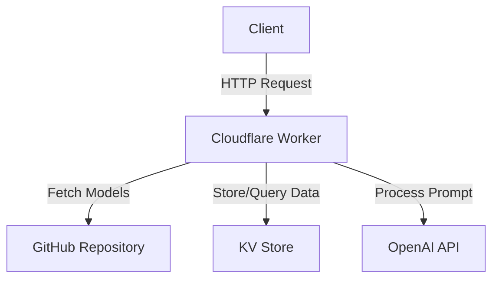
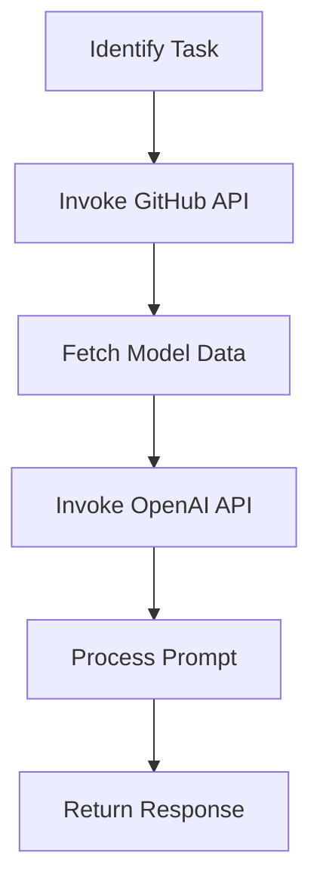

# Model Scraper

Model Scraper is a cloud-based application designed to fetch, store, and query AI model data from GitHub. It provides an API for interacting with the model data, allowing users to update the data, query it based on specific prompts, and filter models by task or capability.

## Table of Contents
- [Overview](#overview)
- [Usage](#usage)
- [Architecture](#architecture)

## Overview
Model Scraper's primary purpose is to manage AI model data by fetching it from a GitHub repository and storing it in a KV store. The application exposes several API endpoints to interact with this data, enabling users to update the model data, query it with specific prompts, and filter models based on tasks or capabilities. The architecture is built using the Hono framework and integrates with OpenAI's API for processing prompts.

## Usage
To start the project locally, use the following command:
```
npx nx start model-scraper
```

### NPM Scripts
- **deploy:production**: Deploys the application to the production environment using Wrangler.
- **deploy:staging**: Deploys the application to the staging environment using Wrangler.
- **dev**: Starts the application in development mode with remote access.
- **lint**: Lints the source code using Biome, reporting errors on warnings.
- **start**: Starts the application in development mode.
- **test**: Runs the test suite using Vitest without watching for changes.
- **test:ci**: Runs the test suite in continuous integration mode.
- **type-check**: Performs TypeScript type checking without emitting files.

### API Endpoints
- **POST /update**: Fetches the model map from GitHub and saves it into the KV store.
  - **Request**: No body required.
  - **Response**: `{ "success": true }`
  - **Curl Command**:
    ```bash
    curl -X POST http://localhost:8787/update
    ```

- **POST /query**: Accepts a prompt and returns a response based on the available models data.
  - **Request**: `{ "prompt": "Your prompt here" }`
  - **Response**: `{ "response": "Response text" }` or a structured JSON object.
  - **Curl Command**:
    ```bash
    curl -X POST http://localhost:8787/query -H "Content-Type: application/json" -d '{"prompt": "Your prompt here"}'
    ```

- **GET /models_by_task?task=...**: Returns an array of models whose task.id matches the provided task parameter.
  - **Request**: Query parameter `task` is required.
  - **Response**: Array of models.
  - **Curl Command**:
    ```bash
    curl -X GET "http://localhost:8787/models_by_task?task=your_task_id"
    ```

- **GET /models_by_capability?capability=...**: Returns models that support tool calling.
  - **Request**: Query parameter `capability` is required.
  - **Response**: Array of models.
  - **Curl Command**:
    ```bash
    curl -X GET "http://localhost:8787/models_by_capability?capability=tools"
    ```

## Architecture
Model Scraper is structured as a serverless application using Cloudflare Workers. It leverages the Hono framework for routing and middleware management. The application interacts with GitHub to fetch model data and uses OpenAI's API for processing prompts.

### System Diagram


### Agentic Patterns
#### Tool Use Pattern
Model Scraper uses the Tool Use Pattern by dynamically interacting with external APIs, such as GitHub and OpenAI, to fetch and process model data.


<!-- Last updated: 038947bb9b4fd6d8d05f28479e966cd36b43658e -->