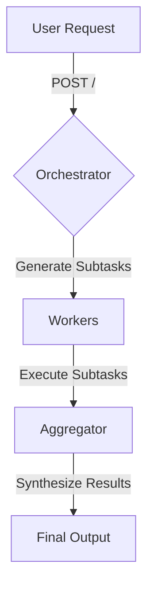
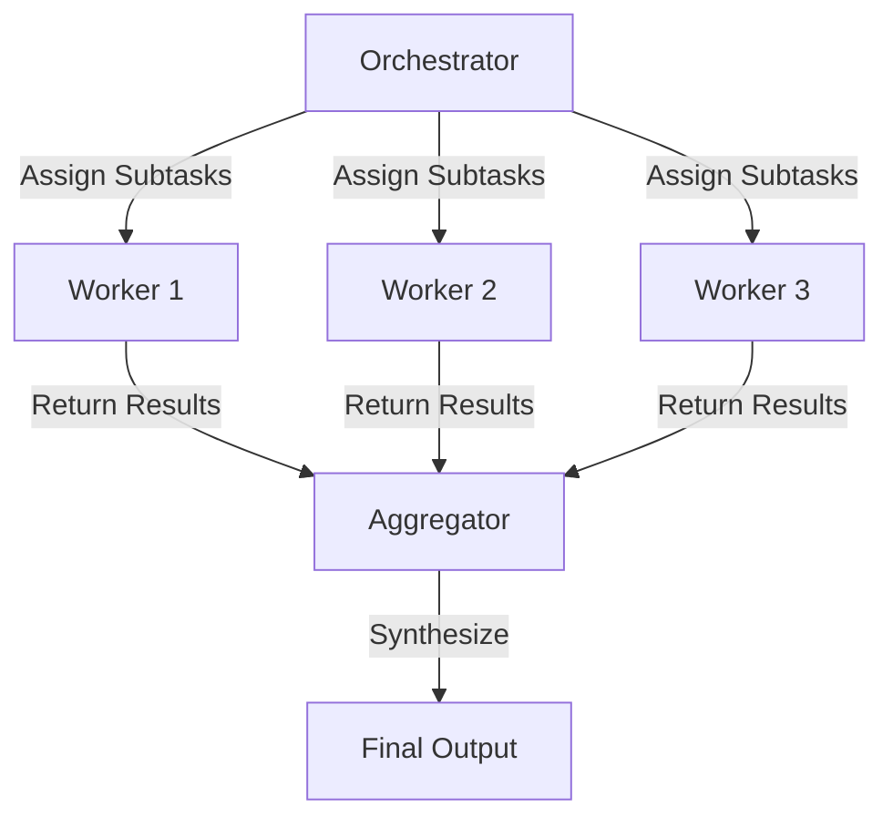

# Orchestrator Workers

This project is designed to manage complex coding tasks by breaking them down into subtasks, executing them in parallel, and synthesizing the results. It leverages AI models to orchestrate and execute these tasks efficiently.

## Table of Contents
- [Overview](#overview)
- [Usage](#usage)
- [Architecture](#architecture)

## Overview
The Orchestrator Workers project is a cloud-based application that utilizes AI to manage and execute complex coding tasks. It breaks down tasks into smaller subtasks, processes them in parallel using specialized AI models, and then synthesizes the results into a comprehensive output. This approach enhances efficiency and accuracy in handling large-scale coding operations.

## Usage
To start the project locally, use the following command:
```
npx nx dev orchestrator-workers
```

### NPM Scripts
- **deploy**: Deploys the application using Wrangler.
```
npx nx deploy orchestrator-workers
```
- **dev**: Starts the development server.
```
npx nx dev orchestrator-workers
```
- **lint**: Lints the codebase for errors and warnings.
```
npx nx lint orchestrator-workers
```
- **start**: Starts the application in development mode.
```
npx nx start orchestrator-workers
```
- **test**: Runs the test suite.
```
npx nx test orchestrator-workers
```
- **test:ci**: Runs the test suite in CI mode.
```
npx nx test:ci orchestrator-workers
```
- **type-check**: Checks TypeScript types.
```
npx nx type-check orchestrator-workers
```

### API Endpoints
- **POST /**: Triggers a new workflow instance. Expects a JSON payload with a `prompt` property.
  ```bash
  curl -X POST \
    -H "Content-Type: application/json" \
    -d '{"prompt": "Your task description here"}' \
    http://localhost:8787/
  ```
  **Response**:
  ```json
  {
    "id": "instance-id",
    "details": "status-details"
  }
  ```

- **GET /:id**: Fetches the status of an existing workflow instance by its ID.
  ```bash
  curl -X GET http://localhost:8787/{id}
  ```
  **Response**:
  ```json
  {
    "status": "current-status"
  }
  ```

## Architecture
The architecture of the Orchestrator Workers project is designed to efficiently manage and execute complex tasks using AI models. The system is divided into three main components:

1. **Orchestrator**: Generates subtasks from a given prompt using a large AI model.
2. **Workers**: Execute each subtask in parallel using smaller, specialized AI models.
3. **Aggregator**: Synthesizes the responses from the workers into a final result.

### System Diagram


### Agentic Patterns
The project employs the **Orchestrator-Workers** pattern, where a central orchestrating AI dynamically assigns subtasks to worker AIs. This pattern is ideal for complex tasks with unpredictable subtask decomposition.

#### Orchestrator-Workers Pattern


<!-- Last updated: 038947bb9b4fd6d8d05f28479e966cd36b43658e -->
