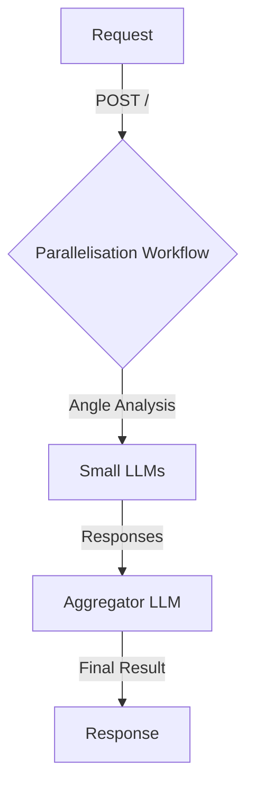
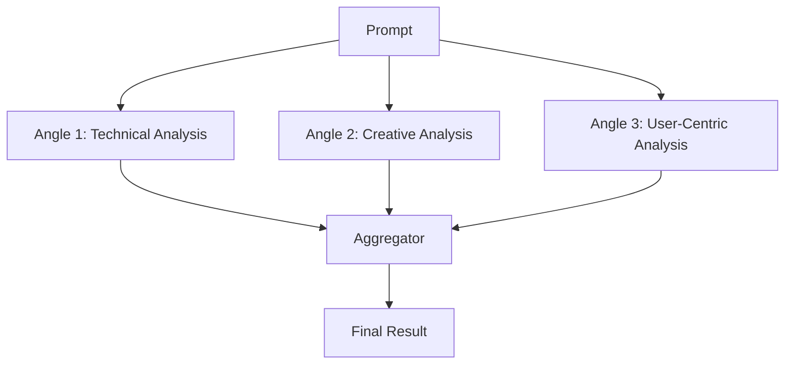

# Parallelisation

Parallelisation is a project designed to execute tasks concurrently using a workflow pattern that leverages AI models for efficient processing. The project focuses on analyzing prompts from multiple perspectives and synthesizing a comprehensive result.

## Table of Contents
- [Overview](#overview)
- [Usage](#usage)
- [Architecture](#architecture)

## Overview
The Parallelisation project is built to handle tasks by executing them in parallel, using multiple AI models to analyze a given prompt from different perspectives. The results are then aggregated to form a comprehensive response. This approach is particularly useful for tasks that benefit from diverse viewpoints and require efficient processing.

## Usage
To start the project locally, you can use the following npm scripts:

- `npx nx deploy parallelisation`: Deploys the project using Wrangler.
- `npx nx dev parallelisation`: Starts the development server with Wrangler.
- `npx nx lint parallelisation`: Lints the source code using Biome.
- `npx nx start parallelisation`: Starts the development server with Wrangler.
- `npx nx test parallelisation`: Runs the tests using Vitest.
- `npx nx test:ci parallelisation`: Runs the tests in CI mode using Vitest.
- `npx nx type-check parallelisation`: Performs TypeScript type checking.

### API Endpoints

#### POST /
- **Description**: Triggers a new workflow instance.
- **Request Format**: JSON with a `prompt` property.
- **Response Format**: JSON with `id` and `details` of the workflow instance.
- **Curl Command**:
  ```bash
  curl -X POST http://localhost:8787/ -H "Content-Type: application/json" -d '{"prompt": "Your prompt here"}'
  ```

#### GET /:id
- **Description**: Fetches the status of an existing workflow instance by its ID.
- **Response Format**: JSON with the `status` of the workflow instance.
- **Curl Command**:
  ```bash
  curl http://localhost:8787/{id}
  ```

## Architecture
The project uses a parallelisation workflow pattern, where tasks are divided into simultaneous operations. This is achieved through the use of multiple AI models that analyze a prompt from different angles, and the results are aggregated to form a final output.

### System Diagram


### Parallelisation Pattern
The project implements the Parallelisation pattern, where tasks are divided into simultaneous LLM operations. This involves sectioning tasks into independent parallel subtasks, allowing for efficient processing and diverse perspectives.



<!-- Last updated: 038947bb9b4fd6d8d05f28479e966cd36b43658e -->