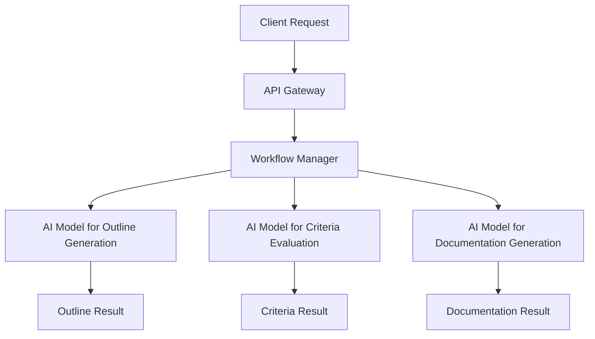
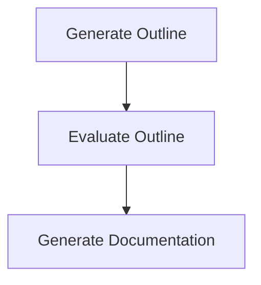

# Prompt Chaining

Prompt Chaining is a workflow application designed to automate the generation of technical documentation through a series of predefined steps. It leverages AI models to create, evaluate, and finalize documentation outlines, ensuring they meet specified criteria before generating the full documentation.

## Table of Contents
1. [Overview](#overview)
2. [Usage](#usage)
3. [Architecture](#architecture)

## Overview
The Prompt Chaining project is a workflow application that automates the creation of technical documentation. It uses a sequence of AI-driven steps to generate an outline, evaluate it against criteria, and produce the final documentation. The application is built using Cloudflare Workers and integrates with AI models to perform its tasks.

## Usage
To start the project locally, use the following command:
```bash
npx nx dev prompt-chaining
```

### NPM Scripts
- **deploy**: Deploys the application using Wrangler.
  ```bash
  npx nx deploy prompt-chaining
  ```
- **dev**: Starts the development server using Wrangler.
  ```bash
  npx nx dev prompt-chaining
  ```
- **lint**: Lints the source code using Biome.
  ```bash
  npx nx lint prompt-chaining
  ```
- **start**: Alias for `dev`, starts the development server.
  ```bash
  npx nx start prompt-chaining
  ```
- **test**: Runs the test suite using Vitest.
  ```bash
  npx nx test prompt-chaining
  ```
- **test:ci**: Runs the test suite in CI mode using Vitest.
  ```bash
  npx nx test:ci prompt-chaining
  ```
- **type-check**: Performs TypeScript type checking.
  ```bash
  npx nx type-check prompt-chaining
  ```

### API Endpoints
- **POST /**: Triggers a new workflow instance.
  - **Request**: JSON payload with a `prompt` property.
  - **Response**: JSON with `id` and `details` of the workflow instance.
  - **Curl Command**:
    ```bash
    curl -X POST http://localhost:8787/ -H "Content-Type: application/json" -d '{"prompt": "Your prompt here"}'
    ```

- **GET /:id**: Fetches the status of an existing workflow instance by ID.
  - **Response**: JSON with the status of the workflow instance.
  - **Curl Command**:
    ```bash
    curl http://localhost:8787/{id}
    ```

## Architecture
The architecture of the Prompt Chaining application is based on a workflow pattern that involves multiple AI-driven steps. The system is designed to handle requests for generating technical documentation by following a structured process.

### System Diagram


### Prompt Chaining Pattern
The project uses the **Prompt Chaining** pattern, which involves sequential decomposition into fixed subtasks. This pattern is ideal for predictable tasks that can be broken down into simple steps, such as generating an outline, verifying it against criteria, and completing the documentation.



<!-- Last updated: 038947bb9b4fd6d8d05f28479e966cd36b43658e -->