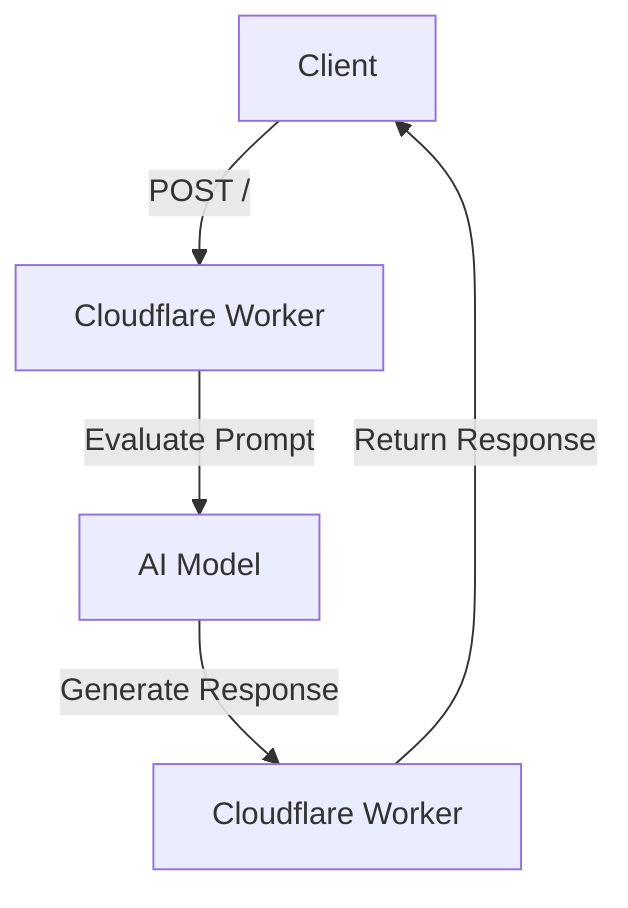
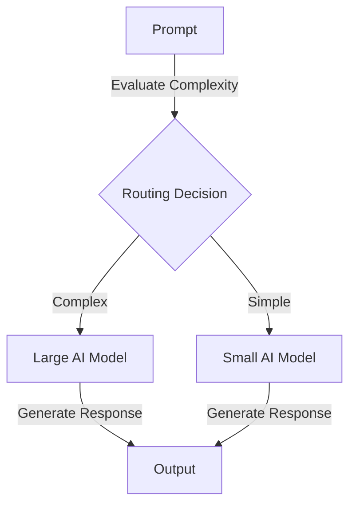

# Routing

This project is a cloud-based application designed to handle routing workflows using AI models. It evaluates prompts and generates detailed responses based on their complexity.

## Table of Contents
- [Overview](#overview)
- [Usage](#usage)
- [Architecture](#architecture)

## Overview
The Routing project is designed to process and evaluate prompts using AI models. It uses a workflow to grade the complexity of a prompt and then generates a detailed response. The project leverages Cloudflare Workers and AI models to perform these tasks efficiently.

## Usage
To start the project locally, use the following command:
```bash
npx nx dev routing
```

### NPM Scripts
- **deploy**: Deploys the application using Wrangler.
  ```bash
  npx nx deploy routing
  ```
- **dev**: Starts the development server using Wrangler.
  ```bash
  npx nx dev routing
  ```
- **lint**: Lints the source code using Biome.
  ```bash
  npx nx lint routing
  ```
- **start**: Alias for `dev`, starts the development server.
  ```bash
  npx nx start routing
  ```
- **test**: Runs the test suite using Vitest.
  ```bash
  npx nx test routing
  ```
- **test:ci**: Runs the test suite in CI mode using Vitest.
  ```bash
  npx nx test:ci routing
  ```
- **type-check**: Performs TypeScript type checking.
  ```bash
  npx nx type-check routing
  ```

### API Endpoints
- **POST /**: Creates a new routing workflow instance.
  - **Request**:
    ```json
    {
      "prompt": "Your prompt here"
    }
    ```
  - **Response**:
    ```json
    {
      "id": "instance-id",
      "details": "status-details"
    }
    ```
  - **Curl Command**:
    ```bash
    curl -X POST http://localhost:8787/ -H "Content-Type: application/json" -d '{"prompt": "Your prompt here"}'
    ```

- **GET /:id**: Retrieves the status of a routing workflow instance.
  - **Response**:
    ```json
    {
      "status": "status-details"
    }
    ```
  - **Curl Command**:
    ```bash
    curl http://localhost:8787/{id}
    ```

## Architecture
The project is structured as a cloud-based application using Cloudflare Workers. It employs a routing workflow to process prompts and generate responses. The architecture includes AI models for evaluating and responding to prompts.

### System Diagram


### Agentic Design Patterns
#### Routing
This project uses the Routing pattern to classify and direct tasks based on the complexity of the input prompt. It evaluates the prompt and selects the appropriate AI model to generate a response.



<!-- Last updated: 038947bb9b4fd6d8d05f28479e966cd36b43658e -->