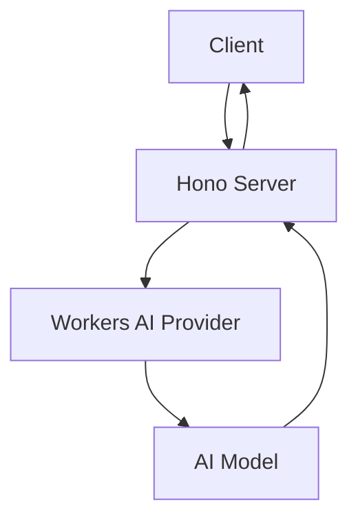
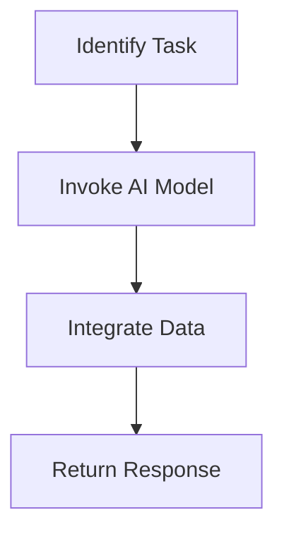

# Text Generation

This project is a text generation application that leverages AI models to generate text based on user prompts. It is designed to be deployed on a serverless platform, providing a scalable and efficient solution for text generation tasks.

## Table of Contents
1. [Overview](#overview)
2. [Usage](#usage)
3. [Architecture](#architecture)

## Overview
The Text Generation project is built to provide an API for generating text using AI models. It utilizes the Hono framework for handling HTTP requests and integrates with AI models through the Workers AI provider. The primary functionality is to accept a text prompt and return generated text based on that prompt.

## Usage
To start the project locally, you can use the following npm scripts:

- `npx nx dev text-generation`: Starts the development server using Wrangler.
- `npx nx deploy text-generation`: Deploys the application using Wrangler.
- `npx nx lint text-generation`: Lints the source code using Biome.
- `npx nx start text-generation`: Starts the application in development mode.
- `npx nx test text-generation`: Runs the test suite using Vitest.
- `npx nx test:ci text-generation`: Runs the test suite in CI mode using Vitest.
- `npx nx type-check text-generation`: Performs TypeScript type checking.

### API Usage
The application exposes a single API endpoint:

- **POST /**
  - **Request:**
    - Method: POST
    - Headers: `Content-Type: application/json`
    - Body: `{ "prompt": "Your text prompt here" }`
  - **Response:**
    - Content-Type: application/json
    - Body: `{ "generatedText": "Generated text based on the prompt" }`
  - **Curl Command:**
    ```bash
    curl -X POST \
    -H "Content-Type: application/json" \
    -d '{ "prompt": "Your text prompt here" }' \
    http://localhost:8787/
    ```

## Architecture
The Text Generation project is structured as a serverless application using the Hono framework. It integrates with AI models via the Workers AI provider, allowing for scalable and efficient text generation.

### System Diagram


### Tool Use Pattern
The project employs the Tool Use Pattern by dynamically interacting with external AI models to generate text. This pattern involves identifying the task (text generation), invoking the appropriate AI model, and integrating the returned data into the workflow.



<!-- Last updated: 038947bb9b4fd6d8d05f28479e966cd36b43658e -->