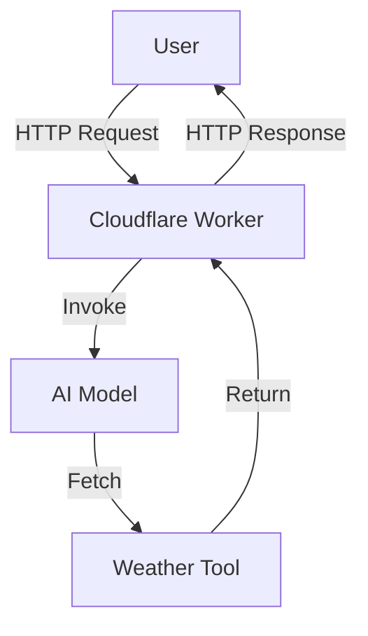
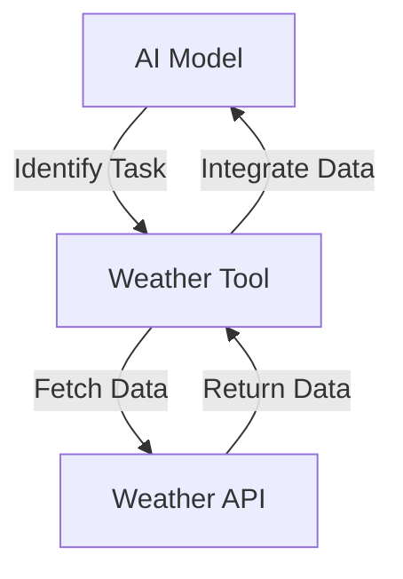

# Tool Calling Stream Traditional

This project is a serverless application designed to interact with AI models and tools, specifically for fetching weather information based on user input. It leverages the Hono framework and Cloudflare Workers to provide a scalable and efficient solution.

## Table of Contents
- [Overview](#overview)
- [Usage](#usage)
- [Architecture](#architecture)

## Overview
The Tool Calling Stream Traditional project is built to demonstrate the integration of AI models with external tools in a serverless environment. The primary functionality is to process user prompts, determine the appropriate tool to use, and fetch weather information for a specified location. The architecture is designed to handle requests efficiently using Cloudflare Workers and the Hono framework.

## Usage
To start the project locally, use the following command:
```bash
npx nx dev tool-calling-stream-traditional
```

### NPM Scripts
- **deploy**: Deploys the application using Wrangler.
  ```bash
  npx nx deploy tool-calling-stream-traditional
  ```
- **dev**: Starts the development server using Wrangler.
  ```bash
  npx nx dev tool-calling-stream-traditional
  ```
- **lint**: Lints the source code using Biome.
  ```bash
  npx nx lint tool-calling-stream-traditional
  ```
- **start**: Alias for the dev script.
  ```bash
  npx nx start tool-calling-stream-traditional
  ```
- **test**: Runs the test suite using Vitest.
  ```bash
  npx nx test tool-calling-stream-traditional
  ```
- **test:ci**: Runs the test suite in CI mode using Vitest.
  ```bash
  npx nx test:ci tool-calling-stream-traditional
  ```
- **type-check**: Performs TypeScript type checking.
  ```bash
  npx nx type-check tool-calling-stream-traditional
  ```

### API Interaction
The project exposes an API endpoint to interact with the AI model and tools.

#### POST /
- **Request**:
  - **Body**: `{ "prompt": "<user_prompt>" }`
- **Response**:
  - **Body**: Weather information based on the specified location.

**Example cURL Command**:
```bash
curl -X POST \
  -H "Content-Type: application/json" \
  -d '{"prompt": "What's the weather in London?"}' \
  http://localhost:8787/
```

## Architecture
The architecture of the Tool Calling Stream Traditional project is centered around serverless principles, utilizing Cloudflare Workers and the Hono framework to handle HTTP requests and interact with AI models.

### System Diagram


### Tool Use Pattern
This project employs the Tool Use Pattern, where the AI model dynamically interacts with external tools to extend its capabilities. In this case, the AI model identifies the need to fetch weather information and invokes the appropriate tool to obtain the data.



<!-- Last updated: 038947bb9b4fd6d8d05f28479e966cd36b43658e -->