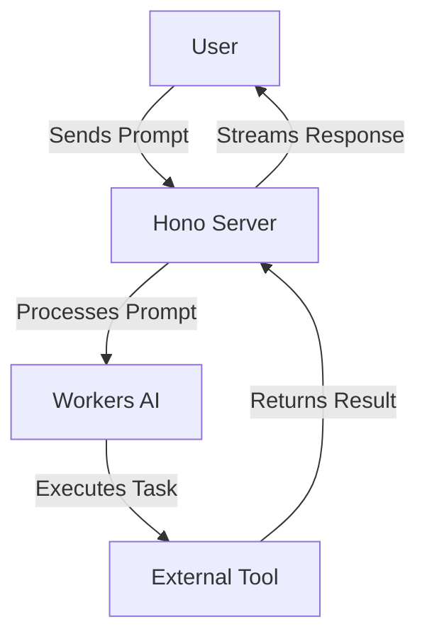
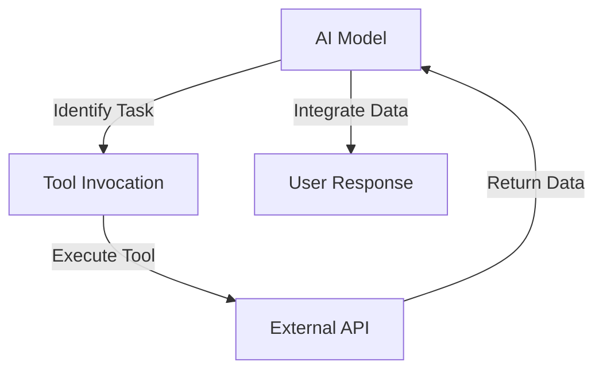

# Tool Calling Stream

Tool Calling Stream is a project designed to provide a streaming interface for AI models, allowing them to interact with external tools dynamically. The project leverages AI models to process user prompts and execute tasks such as fetching weather information.

## Table of Contents
1. [Overview](#overview)
2. [Usage](#usage)
3. [Architecture](#architecture)

## Overview
The Tool Calling Stream project serves as a streaming interface for AI models, enabling them to interact with external tools in real-time. The primary functionality includes processing user prompts and executing tasks like retrieving weather data. The architecture is built using the Hono framework, with AI models provided by Workers AI.

## Usage
To start the project locally, use the following command:
```
npx nx dev tool-calling-stream
```
This command runs the project in development mode using Wrangler.

### NPM Scripts
- **deploy**: Deploys the project using Wrangler.
  ```
npx nx deploy tool-calling-stream
  ```
- **dev**: Starts the project in development mode.
  ```
npx nx dev tool-calling-stream
  ```
- **lint**: Lints the source code using Biome.
  ```
npx nx lint tool-calling-stream
  ```
- **start**: Alias for `dev`, starts the project in development mode.
  ```
npx nx start tool-calling-stream
  ```
- **test**: Runs the test suite using Vitest.
  ```
npx nx test tool-calling-stream
  ```
- **test:ci**: Runs the test suite in CI mode.
  ```
npx nx test:ci tool-calling-stream
  ```
- **type-check**: Performs TypeScript type checking.
  ```
npx nx type-check tool-calling-stream
  ```

### API Usage
The project exposes an API with the following endpoints:

#### POST /
- **Description**: Processes a user prompt and returns a streaming response.
- **Request Format**:
  ```json
  {
    "prompt": "What is the weather in London?"
  }
  ```
- **Response Format**: Streaming response with weather information.
- **Curl Command**:
  ```bash
  curl -X POST \
    -H "Content-Type: application/json" \
    -d '{"prompt": "What is the weather in London?"}' \
    http://localhost:8787/
  ```

## Architecture
The architecture of the Tool Calling Stream project is designed to facilitate real-time interaction between AI models and external tools. The system is built using the Hono framework and integrates with Workers AI for model execution.

### System Diagram


### Agentic Patterns
The project utilizes the **Tool Use Pattern**, where the AI model dynamically interacts with external tools to extend its capabilities. This pattern involves identifying tasks, invoking appropriate tools, and integrating returned data into the workflow.

#### Tool Use Pattern Diagram


<!-- Last updated: 038947bb9b4fd6d8d05f28479e966cd36b43658e -->