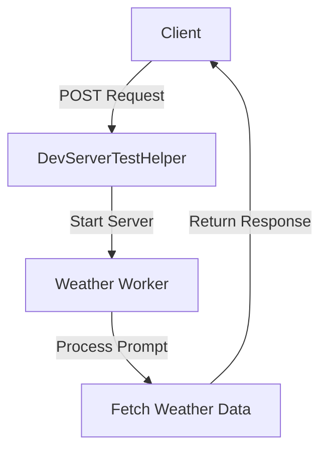

# Tool Calling

This project is designed to facilitate the integration and testing of tool-calling capabilities within a server environment. It includes a series of integration tests to ensure reliable performance when interacting with external APIs or services.

## Table of Contents
1. [Overview](#overview)
2. [Usage](#usage)
3. [Architecture](#architecture)

## Overview
The Tool Calling project is focused on testing the reliability and accuracy of tool-calling operations, particularly in the context of weather data retrieval. The project includes integration tests that simulate real-world scenarios to verify the system's ability to correctly interpret and respond to weather-related prompts.

## Usage
To start the project locally, ensure that all dependencies are installed and run the following command from the root of the project directory:

```bash
npx nx test tool-calling
```

This command will execute the integration tests defined in the `integration.test.ts` file, which include scenarios for identifying weather conditions in different cities.

### NPM Scripts
- `test tool-calling`: Runs the integration tests for the tool-calling project.

## Architecture
The architecture of the Tool Calling project is designed to support robust testing of tool-calling functionalities. The integration tests are structured to simulate interactions with a server that processes weather-related prompts and returns appropriate responses.

### System Diagram


The diagram illustrates the flow of data from the client to the server, where the `DevServerTestHelper` manages the server lifecycle, and the `Weather Worker` processes prompts to fetch and return weather data.

<!-- Last updated: 0308b1a3da967e903a9ef2c03aa3e4608ce199e9 -->