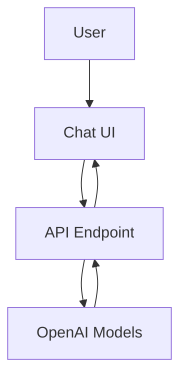
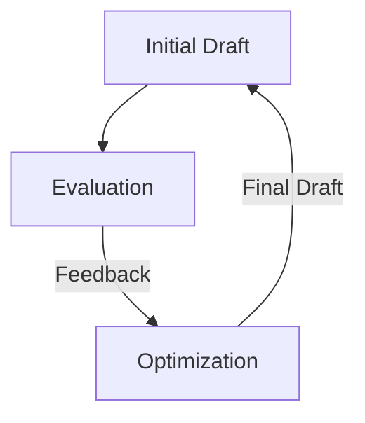

# UI Worker

This project is a web application built with Vite, React, and TypeScript. It features a chat interface that interacts with an AI model to generate, evaluate, and optimize text drafts. The application is designed to run on Cloudflare Workers, providing a scalable and efficient serverless environment.

## Table of Contents
- [Overview](#overview)
- [Usage](#usage)
- [Architecture](#architecture)

## Overview
The UI Worker project serves as a chat interface that allows users to interact with AI models for text generation tasks. It leverages OpenAI's models to generate initial drafts, evaluate them, and optimize the drafts based on feedback. The application is structured to run on Cloudflare Workers, ensuring high availability and performance.

## Usage
To start the project locally, use the following command:

```bash
npx nx dev ui-worker
```

### NPM Scripts
- **dev**: Starts the development server using Vite.
- **build**: Builds the project for production using Vite.
- **lint**: Lints the source code using Biome.
- **preview**: Builds the project and starts a local server to preview the production build.
- **deploy**: Builds the project and deploys it to Cloudflare using Wrangler.
- **test**: Runs the test suite using Vitest.
- **test:ci**: Runs the test suite in continuous integration mode using Vitest.
- **type-check**: Checks TypeScript types without emitting files.

### API Usage
The project exposes an API endpoint at `/api` for text generation tasks. Below is an example of how to interact with the API using a curl command:

#### Request
```bash
curl -X POST \
  http://localhost:8787/api \
  -H 'Content-Type: application/json' \
  -d '{"prompt": "Your task description here"}'
```

#### Response
The response will be a JSON object containing the initial draft, evaluation feedback, and the final optimized draft:

```json
{
  "initialDraft": "Initial draft text.",
  "evaluation": {
    "feedback": "Feedback text.",
    "needsRevision": true
  },
  "finalDraft": "Final optimized draft text."
}
```

## Architecture
The UI Worker project is structured as a serverless application running on Cloudflare Workers. It consists of a client-side React application and a server-side API that interacts with OpenAI models.

### System Diagram


### Agentic Patterns
The project uses the Evaluator-Optimizer pattern, where the AI model iteratively refines text drafts based on evaluation feedback.

#### Evaluator-Optimizer Pattern
This pattern involves an iterative refinement loop between task execution and evaluation. In this project, the AI model generates an initial draft, evaluates it, and optimizes it based on feedback.



<!-- Last updated: 038947bb9b4fd6d8d05f28479e966cd36b43658e -->